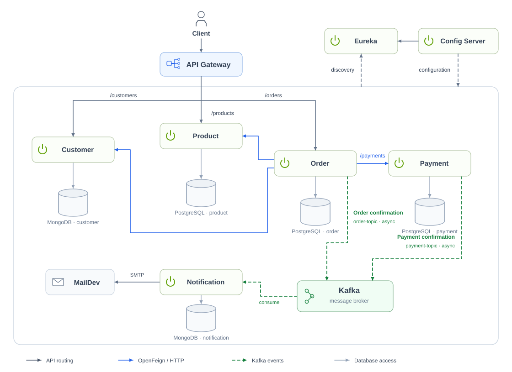

# Spring Boot Microservices E-Commerce

An e-commerce project for learning the microservices ecosystem with **Spring Boot and Spring Cloud**. Based on
**Alibou’s microservices project**, with my own tweaks and adjustments.

## Architecture



The gateway routes requests to the business services. Order uses OpenFeign to call customer, product, and payment
services. Order and payment confirmations travel through Kafka to notification service, which stores notifications
and sends emails to MailDev.

The gateway and business services use **Eureka** for discovery and **Config Server** for configuration. All containers
share the Compose network. Database labels represent separate databases within the PostgreSQL and MongoDB containers.

Route labels are relative to `/api/v1`. Payment, notification, and order-line routes are also exposed through the
gateway; notification service additionally looks up customer details over HTTP. These connections are omitted from
the preview for readability.

The [SVG preview](docs/architecture.svg) preserves the layout above;
the [Mermaid version](docs/architecture.mmd) is available for editing.

## Tech stack

Java 21, Spring Boot 4.1.1, Spring Cloud 2025.1.3, Maven, PostgreSQL, MongoDB, Kafka (KRaft), Flyway, and Docker
Compose. `shared/common` contains shared API responses and messaging utilities.

## Run with Docker

### 1. Prerequisites

- Docker Desktop running, or Docker Engine with Docker Compose and BuildKit.
- Enough Docker memory for eight Java services plus the databases and Kafka; around 10 GB is a practical starting point.
- `curl` for the API examples. Java and Maven are included in the Docker build images.

Run the following commands from the repository root.

### 2. Build and start

```sh
docker compose up -d --build --wait --wait-timeout 600
docker compose ps --all
```

The first build downloads images and Maven dependencies. Compose waits for healthy dependencies before starting
dependent services, including Config Server, Eureka, and the gateway.

`postgres-init` creates the `product`, `order`, and `payment` databases, including on existing volumes. Flyway applies
migrations and seeds sample products. `kafka-init` prepares Kafka volume permissions. Both initialization containers
should finish with exit code `0`.

### 3. Check the application

```sh
curl http://localhost:8222/actuator/health/readiness
curl http://localhost:8222/api/v1/products
```

Expect readiness status `UP` and a product list in the response's `data` field. Open
the [Eureka dashboard](http://localhost:8761) to inspect registered services.

## Local endpoints

| Component            | Address / port                                                                            | Purpose                                                  |
|----------------------|-------------------------------------------------------------------------------------------|----------------------------------------------------------|
| API Gateway          | [localhost:8222](http://localhost:8222)                                                   | Main API entry point                                     |
| Eureka               | [localhost:8761](http://localhost:8761)                                                   | Service registry dashboard                               |
| Config Server        | [localhost:8888/customer-service/default](http://localhost:8888/customer-service/default) | Example service configuration                            |
| Customer service     | `localhost:8090`                                                                          | `/api/v1/customers`                                      |
| Product service      | `localhost:8050`                                                                          | `/api/v1/products`                                       |
| Order service        | `localhost:8070`                                                                          | `/api/v1/orders`, `/api/v1/order-lines`                  |
| Payment service      | `localhost:8060`                                                                          | `/api/v1/payments`                                       |
| Notification service | `localhost:8040`                                                                          | `/api/v1/notifications`                                  |
| Mongo Express        | [localhost:8081](http://localhost:8081)                                                   | Browse MongoDB data                                      |
| MailDev              | [localhost:1080](http://localhost:1080)                                                   | View captured emails; SMTP on `1025`                     |
| PostgreSQL           | `localhost:5432`                                                                          | User/password: `admin` / `admin`                         |
| MongoDB              | `localhost:27017`                                                                         | User/password: `admin` / `admin`, auth database: `admin` |
| Kafka                | `localhost:9092`                                                                          | Host clients; containers use `kafka:19092`               |

Published ports bind to `127.0.0.1`. The bundled credentials and infrastructure are for local learning.

## Try the order flow

### 1. Create a customer

```sh
curl -i -X POST http://localhost:8222/api/v1/customers \
  -H 'Content-Type: application/json' \
  -d '{
    "firstname": "Alex",
    "lastname": "Learner",
    "email": "alex@example.com",
    "address": {
      "street": "Main Street",
      "houseNumber": "1",
      "zipCode": "1000"
    }
  }'
```

Copy `data.id` from the response.

### 2. Pick a product

```sh
curl http://localhost:8222/api/v1/products
```

Choose a product with available stock. Note its `id` and `price`; IDs can differ between database volumes.

### 3. Place an order

Replace `CUSTOMER_ID`, set `productId` to the selected product's ID, and set `amount` to its price for a quantity of
one. The numbers below are examples.

```sh
curl -i -X POST http://localhost:8222/api/v1/orders \
  -H 'Content-Type: application/json' \
  -d '{
    "reference": "LEARNING-ORDER-001",
    "amount": 24.99,
    "paymentMethod": "VISA",
    "customerId": "CUSTOMER_ID",
    "products": [{"productId": 2, "quantity": 1}]
  }'
```

A successful request returns HTTP `201` with the order ID in `data`. The order service checks the customer, purchases
stock, records the order, and requests payment. Order and payment confirmation events then reach the notification
service through Kafka.

### 4. View the result

```sh
curl http://localhost:8222/api/v1/orders
curl http://localhost:8222/api/v1/notifications
```

Open [MailDev](http://localhost:1080) to view the order and payment emails. Notifications arrive asynchronously, so
allow a few seconds.

## Everyday commands

```sh
# Follow application logs
docker compose logs -f gateway-server order-service payment-service notification-service

# Rebuild a changed service
docker compose up -d --build --wait order-service

# List Kafka topics
docker compose exec kafka /opt/kafka/bin/kafka-topics.sh \
  --bootstrap-server kafka:19092 --list

# Stop the stack and keep stored data
docker compose down
```

PostgreSQL, MongoDB, and Kafka use named volumes. To reset all local data, run `docker compose down -v`; this deletes
those volumes, and the next startup recreates the databases and seed data.

If startup fails, inspect `docker compose ps --all` and `docker compose logs --tail=100 SERVICE_NAME`. Check for
occupied ports, Docker memory limits, or failed initialization containers. If the gateway briefly returns `503` after
startup, allow Eureka registration to settle and retry.

## Local development

With Java 21 and Maven installed, build and run tests from the repository root:

```sh
mvn verify

# Verify one service and its shared dependencies
mvn -pl services/order-service -am verify
```

Docker builds skip tests, so run these checks separately when changing code.

To run the Spring services from your IDE, first stop any containerized application services and start only
infrastructure:

```sh
docker compose down
docker compose up -d --wait postgres-init mongodb kafka mail-dev mongo-express
mvn -DskipTests install
```

Start **Config Server → Discovery Server → customer, product, and payment services → order and notification services →
Gateway**. The checked-in configuration uses `localhost` for IDE runs; Compose overrides addresses with container
service names.

## Project layout

```text
services/
  config-server/        Centralized configuration
  discovery-server/     Eureka registry
  gateway-server/       API routing
  customer-service/     Customers and addresses
  product-service/      Catalog and stock
  order-service/        Orders and order lines
  payment-service/      Payment records and events
  notification-service/ Notifications and emails
shared/common/          API responses and messaging utilities
infra/postgres/         Database initialization
docker-compose.yml      Complete local stack
```
